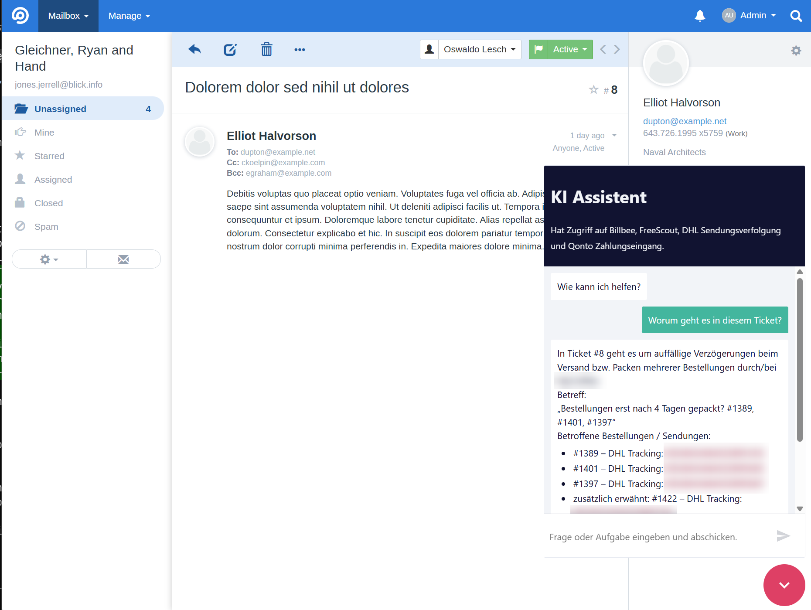
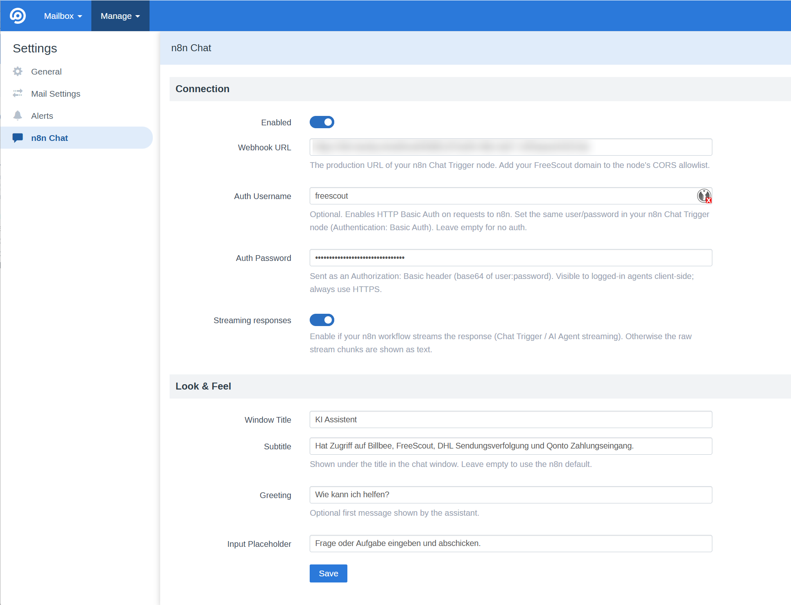

# N8nChat — n8n AI chat for FreeScout

Embeds the [@n8n/chat](https://www.npmjs.com/package/@n8n/chat) widget into the FreeScout
agent UI. Every message carries FreeScout context (which ticket is open, the agent, the
customer). Conversation memory is scoped per agent per ticket.

> 💡 **Need help building your n8n AI assistant?**
> [automaze.me](https://automaze.me) designs and implements n8n AI assistants and FreeScout
> integrations — from first prototype to production. **Book a free 30-minute consultation →
> [automaze.me/contact](https://automaze.me/contact)**

## Screenshots

The AI assistant, open inside a ticket with full conversation context:



Settings — connect your n8n webhook and customise the chat window:



## Install

1. Download `N8nChat.zip` from the
   [latest release](https://github.com/automaze-me/freescout-n8nchat/releases/latest).
2. Extract it into your FreeScout `Modules/` directory, so you end up with `Modules/N8nChat/`.
3. In FreeScout, go to **Manage → Modules** and **Activate** "N8nChat".
   If assets don't load, clear the cache: `php artisan freescout:clear-cache`.

Once installed, FreeScout can update it in place (the module ships `latestVersionUrl` /
`latestVersionZipUrl`).

## Setup (FreeScout side)

1. Modules → activate **N8nChat**.
2. Manage → Settings → **n8n Chat**:
   - **Enabled**: on
   - **Webhook URL**: your n8n Chat Trigger *production* URL (ends in `/chat`)
   - **Auth Username / Auth Password** (optional): HTTP Basic Auth credentials, sent as an
     `Authorization: Basic …` header. Must match the Chat Trigger's Basic Auth setting.
   - Optional: streaming, window title, subtitle, greeting, input placeholder

## Setup (n8n side)

1. Add a **Chat Trigger** node. In its options, set **Allowed Origins (CORS)** to your
   FreeScout domain.
2. To require authentication, set the Chat Trigger's **Authentication** to **Basic Auth**
   and use the same username/password you entered in FreeScout (the widget sends them as an
   `Authorization: Basic` header). n8n's Chat node only supports Basic Auth.
3. Wire the trigger into an **AI Agent** node with a **memory** node keyed on the
   incoming `sessionId` (format `fs-user-<uid>-conv-<cid>` or `fs-user-<uid>-general`).
4. To use ticket context, read `metadata.conversation` from the trigger payload. For the
   full thread, call the FreeScout API using `metadata.conversation.id`.

> 🧩 **Tip:** the
> [`@automaze.me/n8n-nodes-freescout`](https://www.npmjs.com/package/@automaze.me/n8n-nodes-freescout)
> community node package gives you native n8n nodes for the FreeScout API (a **Freescout**
> action node and a **FreescoutTrigger** node) — so you can read threads, create/update
> conversations, and more without hand-crafting HTTP requests. Install it in n8n via
> **Settings → Community Nodes → Install** with the package name `@automaze.me/n8n-nodes-freescout`.

### Payload shape

```json
{
  "action": "sendMessage",
  "sessionId": "fs-user-7-conv-123",
  "chatInput": "summarise this ticket",
  "metadata": {
    "agent": { "id": 7, "name": "Jane Doe", "email": "jane@x.com", "role": "user" },
    "conversation": {
      "id": 123, "number": 456, "subject": "Refund request", "status": "active",
      "mailbox": { "id": 2, "name": "Support" },
      "customer": { "name": "Bob", "email": "bob@x.com" }, "assignee": "Jane Doe"
    }
  }
}
```

## Security note

The Basic Auth credentials are rendered client-side (agents are trusted users). They gate
against anonymous internet abuse of the webhook, but are **not** a secret from agents. The
password is encrypted at rest and masked in the form. Always use HTTPS.

## Content-Security-Policy

FreeScout serves a strict CSP (`script-src 'self' 'nonce-…'`, no explicit `connect-src`).
The module handles this automatically — no admin action needed:

- the injected config `<script>` carries FreeScout's per-request nonce (`\Helper::cspNonceAttr()`);
- a `csp.script_src` filter adds the configured webhook host to `default-src`, which the
  widget's `connect-src` falls back to, so the widget can POST to your n8n instance.

The vendored widget bundle contains no `eval`/`new Function`, so it runs without `unsafe-eval`.

## Updating the widget bundle

The `@n8n/chat` build is vendored in `Public/js/chat.bundle.es.js` + `Public/css/style.css`
(pinned in `Public/VERSION`). To update, re-download those two files from
`https://cdn.jsdelivr.net/npm/@n8n/chat@<version>/dist/` and bump `VERSION`. Keep the
license sidecar `Public/js/chat.bundle.es.js.LICENSE` in sync with the new version.

## License

This module's own code is **AGPL-3.0** (see `module.json`), matching FreeScout core.

It **bundles** the `@n8n/chat` widget (`Public/js/chat.bundle.es.js`, `Public/css/style.css`,
v1.27.2, vendored unmodified), which is **© n8n GmbH under the n8n Sustainable Use License
v1.0** — a *fair-code*, **non-OSI** license. Full text: `Public/js/chat.bundle.es.js.LICENSE`;
summary in `NOTICE`. In short:

- Free to **use and distribute this module free of charge**; running it for your own help
  desk is permitted ("internal business purposes").
- **Do not sell it** or offer it/the widget to third parties **as a hosted service** without
  a separate commercial license from n8n.
- The n8n copyright/license notices in the vendored files must be retained.

To avoid redistributing n8n's code entirely, load `@n8n/chat` from its CDN instead of
vendoring (swap the `Public/js` bundle for a CDN import in `loader.js`).
